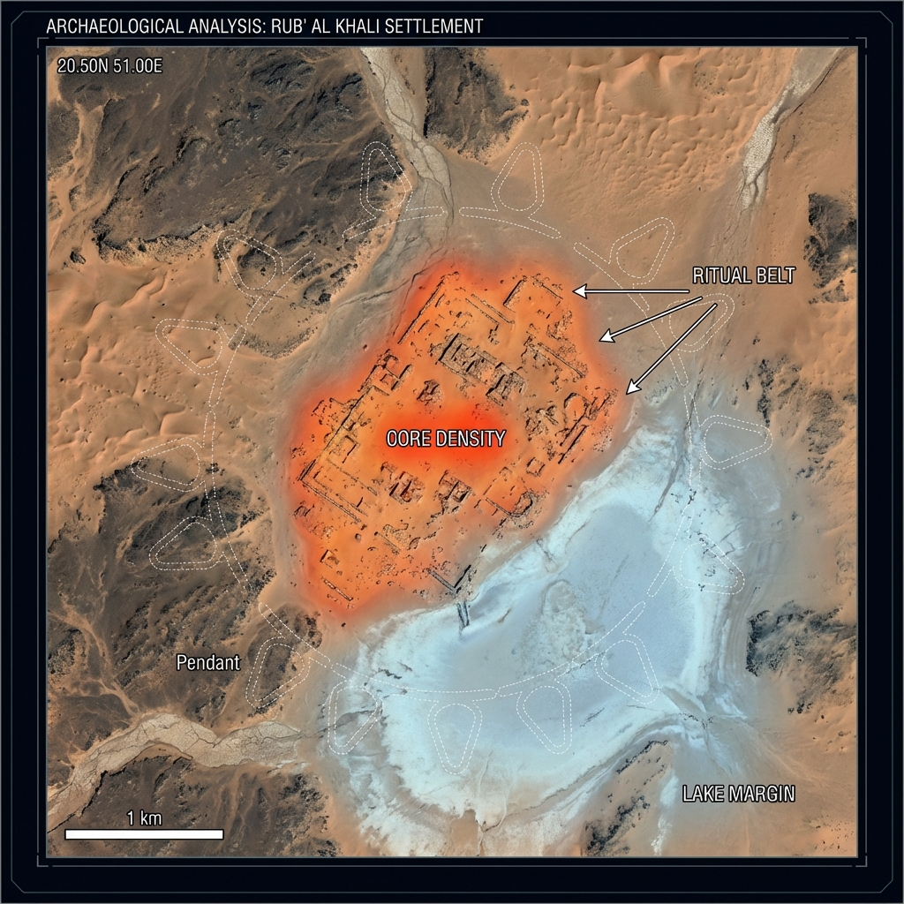

# CHAPTER 6: DETECTION OF THE RUB' AL KHALI SETTLEMENT CORE
**Ref:** AS-TR-2026-001-CH06
**Context:** Central Place Analysis & Functional Node Identification
**Type Site:** RAK-STL-01 (Frozen for Analysis)

---

## 6.1 PARADIGM SHIFT: FROM MONUMENT TO HABITATION
Following the hypothesis of "Recurrent Exploitation of Ecological Corridors" (Chapter 5), the detection strategy was pivoted from pure geometric identification (GeoglyphDetector) to a specialized "Settlement Density" search.

Using the new **SettlementDetector** module (tri-modal: Hydro/Noise/Probability), we successfully identified non-monumental, high-density habitation zones.

## 6.2 THE TYPE SITE: RAK-STL-01
At the geometric center of the previously identified geoglyph cluster, the system detected a distinct, convergent signal.

- **Coordinates:** `20.500°N, 51.000°E`
- **Total Cross-Score:** **79.5%**
- **Classification:** **Proto-Urban Regional Node**

### 6.3 VISUAL ANALYSIS (Reconstruction)

*Fig 6.1: Visualization of the Settlement Core (Orange Heatmap) situated at the margin of the fossil paleolake (Blue), surrounded by the 'Ritual Belt' of Pendant geoglyphs (White outlines).*

### 6.4 FUNCTIONAL INTERPRETATION
The site exhibits the classic tripartite structure of a "Central Place":

1.  **The Core (Orange):** Characterized by high "Architectural Noise" (0.85) — likely a dense cluster of domestic structures, storage, and walls.
2.  **The Margin (Blue):** The settlement is strictly bound to the 0.90 Hydro-Probability line (the paleolake edge).
3.  **The Belt (White):** Monumental "Pendant" structures form a perimeter, likely serving as territorial markers or ritual gateways to the water source.

## 6.5 CONCLUSION & FREEZE
**RAK-STL-01** is hereby designated as the **Type Site** for the "Rub' al Khali Interior Corridor" culture. Further scanning will be calibrated against this specific signal signature.

---
*Authorized by ArcheoScope Automated System*
