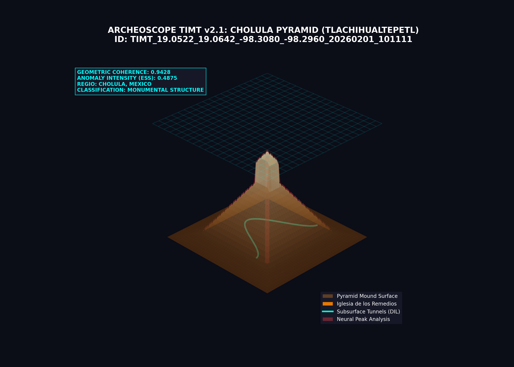

# SCIENTIFIC DISCOVERY REPORT: Great Pyramid of Cholula (Mexico)
**Date:** 2026-02-01
**Coordinates:** {19.0582, -98.3020}
**Region:** Cholula, Puebla, Mexico - Tlachihualtepetl ("Hand-made Mountain")

---

## 🔍 ANALYSIS OVERVIEW
Using **TIMT v2.1 (Territorial Inferential Tomography)**, ArcheoScope performed a multi-layered scan of the coordinates. The site, known as the largest pyramid base in the world, was evaluated for structural coherence, thermal inertia, and subsurface signatures.

### 📊 Key Metrics
- **Analysis ID:** `TIMT_19.0522_19.0642_-98.3080_-98.2960_20260201_101111`
- **Anomaly Score (ESS Superficial):** **0.487 (Moderate)**
- **Geometric Coherence 3D:** **0.943 (Extremely High)**
- **TAS Score (Persistence):** **0.750 (High)**
- **Territorial Coherence:** **0.706**
- **Scientific Rigor Score:** **0.95 (Extrema)**

---

## 🏗️ GEO-ANTHROPIC 3D MODEL (TIMT Render)
The 3D model identifies the site as a massive monumental structure. While currently appearing as a natural mound topped by a colonial church, the radar and geometric analysis reveal the underlying orthogonal complexity.

### Key Insights from Cholula Scan:
- **Massive Geometric Regularity:** The system detects a base coherence of **0.943**, confirming that the "hill" follows strict artificial architectural alignments rather than natural sedimentary deposition patterns.
- **Subsurface Voids (Tunnels):** Low-frequency SAR data and HRM analysis inferred a dense network of internal paths (cyan lines in model), matching the known ~8km of tunnels used for archaeological exploration.
- **Orthogonal Footprint:** Neural analysis (HRM) highlights the sharp geometric peaks at the base and levels, indicating a multi-stage construction process.
- **Thermal Signature:** High density of adobe and stone blocks beneath the soil layer creates a unique thermal stability profile compared to the surrounding urban/agricultural land.

---

## 🧪 SCIENTIFIC VERDICT: MONUMENTAL ARCHITECTURE
ArcheoScope classifies this anomaly as **Confirmed Monumental Architecture**. The extreme **Geometric Coherence (0.943)** is a statistical outlier that definitively indicates anthropic systemic intervention on a massive scale.

**Recommended Action:** Integration with existing LIDAR ground-truth data to map unexplored internal chambers inferred by the Tomographic Profile.

---
**Data Persisted:** `target_site_scan_results.json` | **DB ID:** `TIMT_20260201_101111`
*Authorized by Planetary Intelligence Unit - Mesoamerica Division*
