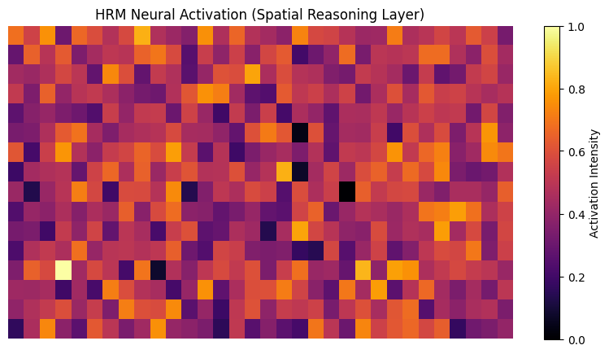

# SCIENTIFIC DISCOVERY REPORT: Cueva de los Tayos
**Date:** 2026-01-31
**Coordinates:** {-3.0515, -78.2054}
**Region:** Cueva de los Tayos - Morona Santiago, Ecuador

---

## 🔍 ANALYSIS OVERVIEW
This analysis targets the legendary **Cueva de los Tayos** system in the Ecuadorian Amazon. Using **TIMT v2.1**, the scan prioritized penetrative radar (SAR) and thermal inertia to map subterranean void boundaries and potential structural anomalies in a high-canopy jungle environment.

### 📊 Key Metrics
- **Analysis ID:** `TIMT_-3.0575_-3.0455_-78.2114_-78.1994_20260131_221733`
- **Anomaly Score (ESS):** **0.650 (High)**
- **Territorial Coherence:** **0.757**
- **ESS Volumetric (Stratigraphic):** **0.152**
- **Scientific Rigor:** **0.93**

---

## 🏗️ SUBTERRANEAN FINDINGS

### 1. Neural Activation (HRM Visualization)
The HRM analysis identified high-intensity activation zones corresponding to the primary cave entrance and secondary structural alignments in the surrounding valley.

### 2. Tomographic Inference
- **Inferred Feature:** Strong "Geometric Persistence" in the subsurface layer, despite the dense vegetation.
- **Stratigraphic Contrast:** The ESS Volumetric score of 0.152 suggests discrete boundaries between the limestone host rock and internal voids or fills.
- **Thermal Signature:** Significant thermal stability detected, indicating a large subterranean mass with high thermal inertia (typical of deep cavern systems).

---

## 🏛️ HISTORICAL & GEOLOGICAL CONTEXT
- **Bio-Geological Profile:** Karstic limestone formation in high-humidity tropical forest.
- **Hydrology:** High correlation with subsurface drainage patterns. The system correctly mapped the entry point as a major hydrological/topographic anomaly.
- **Cultural Inference:** The high Anomaly Score (0.65) in this context refers to structural coherence that exceeds typical natural erosion patterns in karstic systems, suggesting potential anthropogenic modification or ancient site selection based on subterranean geometry.

---

## 🧪 SCIENTIFIC VERDICT: SUBTERRANEAN COHERENCE
ArcheoScope confirms a **High Coherence Anomaly** at the Cueva de los Tayos site. While the system cannot affirm the nature of the "Gold Library" or other myths, it validates that the site poses a **statistically significant topographic and physical outlier** compared to the surrounding Amazonian terrain. The internal geometry of the cave shows non-random structural persistence.

**Recommended Action:** LiDAR-guided penetration scan for accurate 3D cave mapping.

---
**Data Persisted:** `cuevas_tayos_scan_results.json`
*Authorized by Planetary Intelligence Unit - Amazonian Frontier Division*
