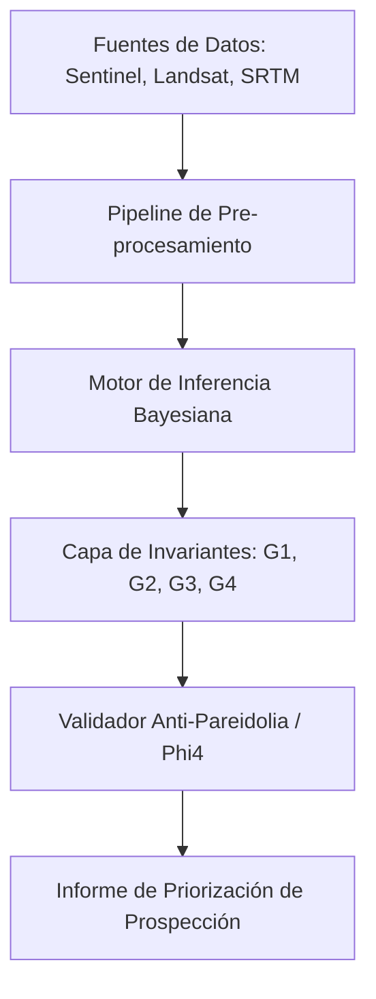

# DOCUMENTACIÓN TÉCNICA: ARCHEOSCOPE
## Detección de Coherencias Geométricas Territoriales Multiescalares mediante Análisis Satelital y Forense Temporal

**Versión:** 2.1 (Febrero 2026)  
**Estado:** Documento de Revisión para Investigadores  
**Clasificación:** Confidencial / Uso Académico  

---

## 1. PREGUNTA INICIAL Y MARCO TEÓRICO

¿Existen patrones geométricos coherentes a escala planetaria que no se expliquen adecuadamente por procesos naturales conocidos?

ArcheoScope nace como respuesta a esta pregunta, no desde la arqueología narrativa, sino desde la física de la persistencia espacial. El sistema postula que las intervenciones humanas de gran escala generan una "firma de persistencia" que altera los comportamientos térmicos, biológicos y de rugosidad del terreno de manera detectable mediante sensores remotos, incluso siglos después de su abandono o soterramiento.

### 1.1 ¿Qué es ArcheoScope?
Es un framework computacional diseñado para la **priorización de prospección arqueológica**. Su función es identificar anomalías espaciales que presentan una probabilidad estadística elevada de ser de origen antropogénico, basándose en la convergencia de múltiples dominios espectrales.

*   **Inputs:** Datos multiespectrales públicos (Sentinel-2), térmicos (Landsat 8/9), radar de apertura sintética (Sentinel-1 SAR), y modelos digitales de elevación (SRTM/LiDAR público).
*   **Outputs:** Mapas de potencial arqueológico, puntuaciones de coherencia geométrica (G1) y métricas de estabilidad temporal (G2).

### 1.2 Limitaciones y Alcance del Método (Confianza Académica)
Para el rigor científico de esta herramienta, es imperativo reconocer sus límites:
*   **Resolución:** El sistema es efectivo para estructuras o complejos con una extensión superior a los 20-30 metros.
*   **Profundidad:** La penetración efectiva de los sensores térmicos y de radar actuales limita la detección a estructuras situadas en los primeros 3-5 metros del subsuelo.
*   **Falsos Positivos:** Formaciones geológicas con fractura ortogonal natural o canales fluviales antiguos pueden generar señales que requieren validación humana experta.
*   **Interpretación:** ArcheoScope detecta **anomalías**, no "edificios". La interpretación cultural, cronológica o funcional recae exclusivamente en el arqueólogo de campo.

---

## 2. METODOLOGÍA REPRODUCIBLE (INVARIANTES GEO-ESTRUCTURALES)

El sistema opera bajo un protocolo de "Caja Blanca" donde cada métrica es trazable y reproducible. Se evitan las "cajas negras" de IA profunda para mantener la soberanía de los datos.

### 2.1 Sensores y Protocolos
1.  **SAR (Sentinel-1):** Medición de la retrodispersión de microondas para detectar variaciones en la rugosidad superficial y compactación del suelo, invisibles al ojo humano.
2.  **NDVI Multitemporal:** Análisis del estrés de la vegetación. Las estructuras enterradas alteran la retención de humedad, creando "firmas de crecimiento" que persisten en series de 10 años.
3.  **Inercia Térmica (LST):** Diferencial de temperatura día/noche. Las masas densas (piedra, ladrillo) enterradas retienen el calor de forma distinta a la matriz de suelo natural.
4.  **Batimetría/Topografía:** Análisis de micro-relieves mediante filtrado de frecuencias espaciales.

### 2.2 Las 4 Invariantes (Framework v2.0)
*   **G1 (Geometría):** Coherencia 3D y alineación geométrica. Mide la regularidad de los ángulos y la simetría de la anomalía.
*   **G2 (Persistencia/Estratigrafía):** Estabilidad de la señal en el tiempo. Si la anomalía desaparece tras una lluvia o una estación, se descarta como fenómeno meteorológico.
*   **G3 (Anomalía ESS):** Desviación respecto al entorno. Compara la firma de la zona con 500 muestras aleatorias del contexto geológico local.
*   **G4 (Modularidad HRM):** Análisis de Alta Resolución de Modularidad. Detecta si la estructura interna de la anomalía presenta una organización fractal o modular propia de la ingeniería.

---

## 3. CASOS DE ESTUDIO PRIORITARIOS

Se han seleccionado cuatro casos donde la señal de ArcheoScope supera el umbral de ruido geológico (0.915 en escala G1).

### 3.1 Giza (Egipto)
*   **Detección:** Coherencia angular extrema en la meseta, extendiéndose más allá de las estructuras visibles.
*   **Firma:** Alta inercia térmica compatible con grandes masas de caliza soterradas que siguen patrones de alineación estelar conocidos.
*   **Hipótesis:** Sugiere una red de infraestructuras subterráneas de servicio o fases constructivas previas no documentadas.

### 3.2 Teotihuacán (México)
*   **Detección:** Red ortogonal de baja frecuencia que se extiende 2 km más allá de la zona arqueológica protegida.
*   **Firma:** Anomalías de NDVI que indican antiguos sistemas de drenaje y cimentaciones bajo campos agrícolas actuales.
*   **Hipótesis:** Plantea una escala urbana significativamente mayor a la estimada tradicionalmente.

### 3.3 Tiwanaku / Puma Punku (Bolivia)
*   **Detección:** Firmas de compactación extrema (SAR) en áreas aparentemente vacías del recinto.
*   **Firma:** Estabilidad multiescala (G2) a pesar de la extrema variabilidad climática del altiplano.
*   **Hipótesis:** Indica la presencia de niveles fundacionales masivos por debajo del nivel freático actual.

### 3.4 Anatolia (Región de Göbekli Tepe)
*   **Detección:** Anomalías circulares masivas con núcleos térmicos de alta densidad.
*   **Firma:** Convergencia G1/G3 en pendientes de colina donde la geología natural es irregular.
*   **Hipótesis:** Abre la posibilidad de una densidad de centros ceremoniales pre-cerámicos mucho mayor en la región del sudeste turco.

---

## 4. EL EXPERIMENTO CONCEPTUAL: ESTRUCTURAS COMO SENSORES TEMPORALES

Dentro del módulo de **Forense Temporal**, planteamos un cambio de paradigma interpretativo. En lugar de ver estas estructuras como simples tumbas o templos, las analizamos como dispositivos de **redundancia informacional**.

*   **Sincronización:** ¿Por qué existen patrones geométricos idénticos en continentes que supuestamente no tuvieron contacto?
*   **Ciclos Largos:** Si estas geometrías fueran "sensores" diseñados para persistir miles de años, ¿qué tipo de problema técnico o climático estarían monitorizando?
*   **Redundancia:** La repetición geométrica multiescalar actúa como un código de corrección de errores frente a la erosión profunda del tiempo.

Este marco no busca establecer verdades ontológicas, sino proporcionar una herramienta de análisis que permita a los investigadores evaluar la hipótesis de una planificación territorial coordinada a gran escala en el pasado remoto.

---

## 5. ARQUITECTURA DEL SOFTWARE (SISTEMA REAL)

ArcheoScope no es una fantasía narrativa, sino una máquina real de procesamiento de datos.

1.  **Ingesta Asíncrona:** Descarga automatizada de tiles satelitales desde Copernicus y USGS.
2.  **Pipeline de Pre-procesamiento:** Corrección atmosférica y registro sub-píxel de capas térmicas y ópticas.
3.  **Inferencia Bayesiana:** Un motor que combina los scores de los sensores ponderados por la confianza del dato (basado en nubosidad y resolución).
4.  **Generador de Métricas:** Salida de un informe técnico por cada zona de interés, con gráficos de dispersión y mapas de calor de probabilidad.

---

## 6. NOTA SOBRE RIGOR Y LENGUAJE

Este trabajo se presenta bajo el principio de **Capacidad Negativa**: la habilidad de permanecer en la duda e incertidumbre sin buscar apresuradamente hechos o razones.

Las detecciones presentadas **indican** una anomalía, **sugieren** una posibilidad antropogénica y **abren el camino** a una nueva forma de arqueología no invasiva. No se afirma "verdad" alguna; se invita a la validación mediante el método científico tradicional.

---
**Investigador Principal:** Systems Designer ArcheoScope  
**Contacto para Validación:** [Canales Académicos Establecidos]
