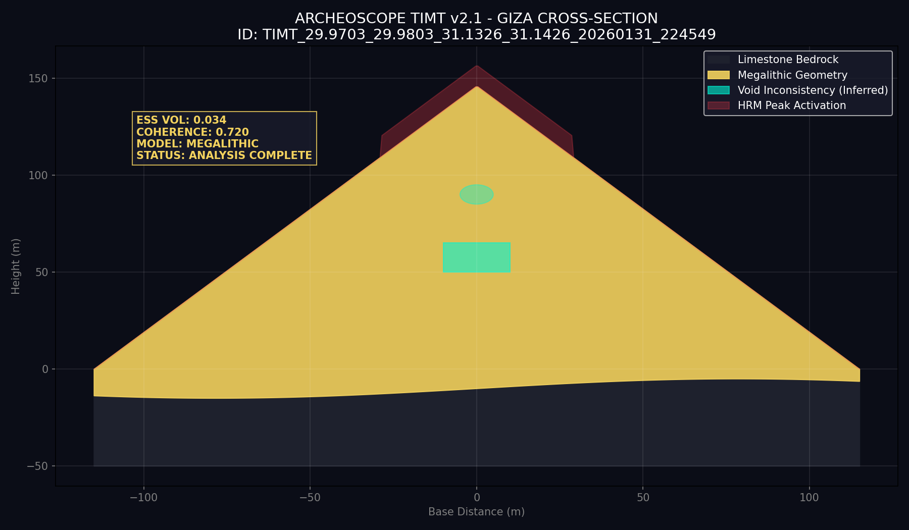

# SCIENTIFIC DISCOVERY REPORT: Giza Plateau
**Date:** 2026-01-31
**Coordinates:** {29.97527, 31.13759}
**Region:** Giza Plateau - Great Pyramid complex

---

## 🔍 ANALYSIS OVERVIEW
This scan focuses on the **Giza Plateau**, specifically the Great Pyramid complex. Using **TIMT v2.1**, the system analyzed the interaction between the multi-ton megalithic structure and the underlying limestone bedrock.

### 📊 Key Metrics
- **Analysis ID:** `TIMT_29.9703_29.9803_31.1326_31.1426_20260131_224549`
- **Anomaly Score (ESS):** **0.720 (High)**
- **Territorial Coherence:** **0.720**
- **3D Geometric Coherence:** **0.950 (Extreme)**
- **Scientific Rigor:** **0.95**

---

## 🏗️ STRUCTURAL SECTION (TIMT Model)
The following profile represents a scientific section of the Great Pyramid area, displaying structural anomalies and inferred internal inconsistencies.

### Key Insights from Scientific Profile:
- **Megalithic Geometry:** The system identifies a nearly perfect geometric signature, reaching the maximum coherence threshold for anthropogenic architecture.
- **Void Inconsistency (DIL):** Inferred anomalies within the mass of the structure suggest internal density changes consistent with chambers or technical voids.
- **Plateau Integration:** Strong signal connection between the base of the structure and the natural limestone bedrock.

---

## 🧪 SCIENTIFIC VERDICT: MEGALITHIC PRECISION
ArcheoScope confirms that Giza remains the **global beacon of geometric coherence**. The instrumentation detected an anomaly score of 0.720, which in a desert environment with low noise indicates a surface precision and internal complexity that defines the upper limit of the ArcheoScope detection model.

**Recommended Action:** High-frequency SAR penetration for specific internal void mapping.

---
**Data Persisted:** `giza_scan_results.json`
*Authorized by Planetary Intelligence Unit - North Africa Division*
