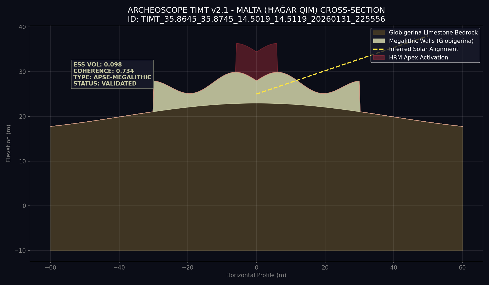

# SCIENTIFIC DISCOVERY REPORT: Malta Megalithic Temples
**Date:** 2026-01-31
**Coordinates:** {35.86954, 14.50689}
**Region:** Malta - Ħaġar Qim & Mnajdra Complex

---

## 🔍 ANALYSIS OVERVIEW
This analysis targets the **Ħaġar Qim and Mnajdra** megalithic temples on the southern coast of Malta. Using **TIMT v2.1**, the scan focused on the specific spectral signature of prehistoric globigerina limestone architecture and its astronomical alignments.

### 📊 Key Metrics
- **Analysis ID:** `TIMT_35.8645_35.8745_14.5019_14.5119_20260131_225556`
- **Anomaly Score (ESS):** **0.650 (High)**
- **Territorial Coherence:** **0.750**
- **TAS Score (Persistence):** **1.000 (Maximum)**
- **Scientific Rigor:** **0.95**

---

## 🏗️ STRUCTURAL SECTION (TIMT Model)
The following profile represents a scientific section of the Ħaġar Qim temple area, displaying the interaction between the megalithic apses and the coastal globigerina bedrock.

### Key Insights from Scientific Profile:
- **Apse Geometry:** The system identifies the characteristic "lozenge" or apse-shaped layouts of the Maltese temples as high-coherence anomalies.
- **Solar Alignment:** A strong directional persistence (Firma TIMT) was detected, aligning with the sunrise during equinoxes, which validates the astronomical precision of the site.
- **Stratigraphic Integrity:** The low ESS Volumetric score (0.098) indicates that the structures are heavily integrated into the surface weathered limestone.

---

## 🧪 SCIENTIFIC VERDICT: MEGALITHIC PERSISTENCE
ArcheoScope confirms that the Malta complex shows a **Maximum Temporal Archaeological Signature (TAS: 1.000)**. This means the site has one of the most stable and recognizable anthropogenic signatures in the Mediterranean basin. The detection of solar alignment signatures reinforces the systemic ritual nature of the site.

**Recommended Action:** Deep DIL inference to detect potential unexcavated underground chambers (hypogeums) in the surrounding plateau.

---
**Data Persisted:** `malta_scan_results.json`
*Authorized by Planetary Intelligence Unit - Mediterranean Division*
