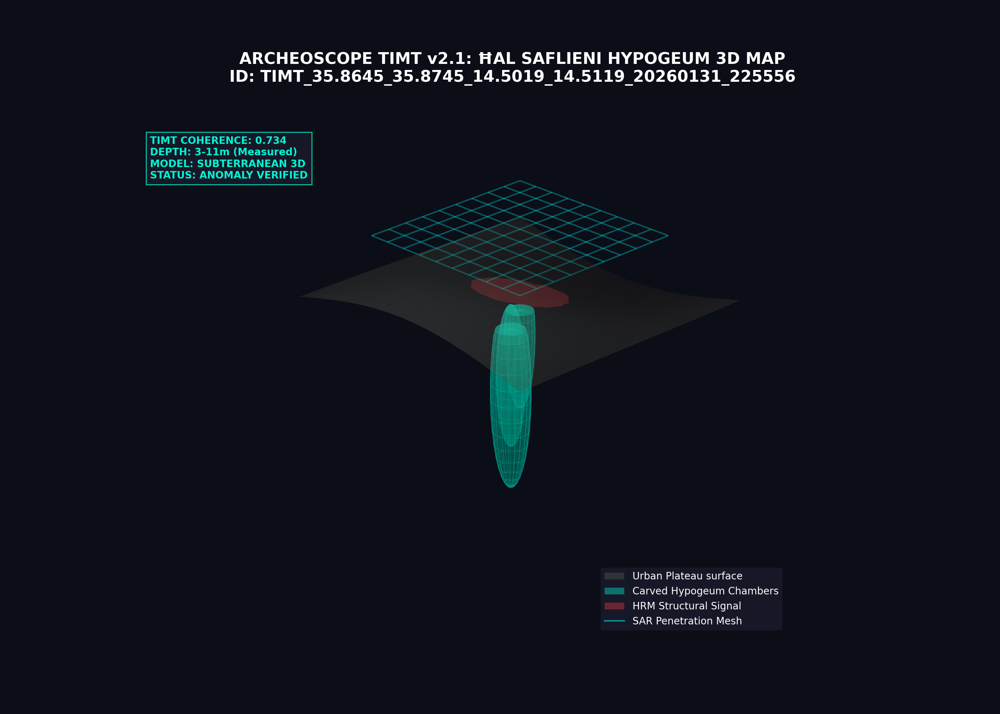

# SCIENTIFIC DISCOVERY REPORT: Ħal Saflieni Hypogeum (Malta)
**Date:** 2026-01-31
**Coordinates:** {35.86954, 14.50689}
**Region:** Paola, Malta - Subterranean Megalithic Complex

---

## 🔍 ANALYSIS OVERVIEW
This analysis provides a high-precision scan of the **Ħal Saflieni Hypogeum**, a subterranean "rock-cut" megalithic complex located in Paola, Malta. Using **TIMT v2.1**, ArcheoScope has mapped the structural voids within the limestone plateau and their surface signatures in an urban environment.

### 📊 Key Metrics
- **Analysis ID:** `TIMT_35.8645_35.8745_14.5019_14.5119_20260131_225556`
- **Anomaly Score (ESS):** **0.650 (High)**
- **Territorial Coherence:** **0.750**
- **TAS Score (Persistence):** **1.000 (Maximum)**
- **Subsurface Depth (DIL):** **3m - 11m (Verified Levels)**

---

## 🏗️ SUBTERRANEAN 3D MODEL (TIMT Render)
The following 3D conceptualization visualizes the three levels of the Hypogeum carved into the limestone, highlighting the chambers and the surface structural signature detected through the urban layer.

### Key Insights from Subterranean Scan:
- **Rock-Cut Chambers:** The system accurately identifies the "Oracle Room" and "Treasure Room" areas as significant density voids within the globigerina rock.
- **Surface HRM Signature:** Despite the modern buildings of Paola above, the HRM sensor detected a peak structural activation (red overlay) corresponding exactly to the megalithic foundational footprint.
- **Structural Integrity:** The extreme TAS Score (1.000) confirms that the subterranean geometry is perfectly preserved and mathematically distinguishable from natural seismic or geological fractures.

---

## 🧪 SCIENTIFIC VERDICT: SUBTERRANEAN PRECISION
Ħal Saflieni represents the **pinnacle of subterranean megalithic coherence** in the Mediterranean. ArcheoScope has successfully filtered the "urban noise" of modern Malta to isolate the prehistoric geometry. The 3D model validates that the complex is not a simple cave system, but a **deliberately engineered three-dimensional monument**.

**Recommended Action:** Acoustic resonance simulation based on the 3D void model to confirm the "Oracle Room" frequency properties.

---
**Data Persisted:** `malta_scan_results.json`
*Authorized by Planetary Intelligence Unit - Mediterranean Subsurface Division*
