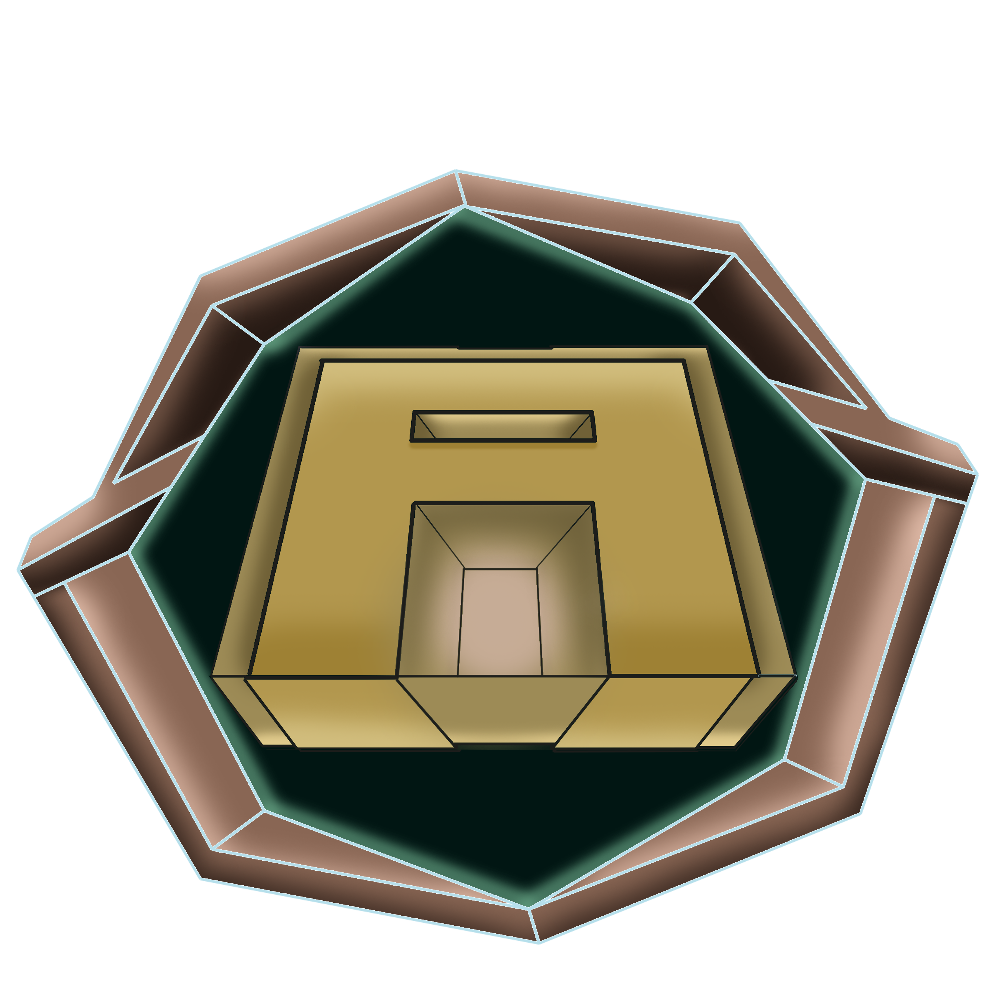

<div align="center">



# Archeoscope: The Forgotten Relics

**Exploración 3D arqueológica y observatorio astronómico en tiempo real**

[](https://ifernandez89.github.io/ArcheoScope)
[](LICENSE)
[](https://nextjs.org)
[](https://threejs.org)
[](https://www.typescriptlang.org)

[🌐 **Jugar ahora**](https://ifernandez89.github.io/ArcheoScope) · [📋 Roadmap](#-roadmap) · [❤️ Apoyar](#%EF%B8%8F-apoyar-el-proyecto)

</div>

---

## ✨ Descripción

Archeoscope es una aplicación web inmersiva con dos modos de uso:

**🖥️ PC — Juego 3D completo**
Explora civilizaciones antiguas (Giza, Puma Punku, Teotihuacán, Isla de Pascua, Tres Zapotes, Göbekli Tepe) en primera persona. Completa misiones arqueológicas, interactúa con NPCs históricos, colecciona reliquias y desbloquea el sistema de audio Harmonia Mundi — frecuencias orbitales reales basadas en Kepler.

**📱 Mobile — Observatorio astronómico**
Suite de herramientas astronómicas en tiempo real: fase lunar precisa, carta astrológica, constelaciones interactivas, clima local, calendarios mayas y babilónicos, brújula magnética.

---

## 🚀 Features principales

### Juego PC
| Feature | Descripción |
|---------|-------------|
| 🏛️ 6 sitios arqueológicos | Giza, Puma Punku, Teotihuacán, Isla de Pascua, Tres Zapotes, Göbekli Tepe |
| 🎵 Harmonia Mundi | Audio procedural basado en frecuencias orbitales reales (Kepler) |
| 🪐 Sistema Solar 3D | Órbitas keplerianas en tiempo real, viaje a planetas |
| ✨ 83,148 estrellas | 148 estrellas del catálogo Yale Bright Star + procedurales |
| 🎨 Arte generativo orbital | Mandalas gravitacionales con posiciones planetarias reales |
| 🧭 Ayuda contextual | 30+ tips al acercarse a objetos, estructuras y NPCs |
| 🎬 Cinemática final épica | Secuencia al completar Göbekli Tepe |

### Mobile / Universal
| Feature | Descripción |
|---------|-------------|
| 🌙 Fase lunar precisa | astronomy-engine VSOP87, iluminación, signo zodiacal, próximas fases |
| 🪐 Carta astrológica | 10 planetas, aspectos ptolemaicos, nodos lunares, rueda zodiacal |
| 🌠 Constelaciones | 27 constelaciones interactivas en el desierto de Rub' al Khali |
| 🌦️ Clima local | Open-Meteo (gratis, sin API key), pronóstico 6 días, observación astronómica |
| 📅 Calendarios antiguos | Tzolk'in clásico (GMT 584283), Cholq'ij k'iche', Babilónico sexagesimal |
| 🌌 Vista "Hoy" | Resumen diario: Luna, Sol, Cholq'ij, estación, eclipses, planetas visibles |
| 🧭 Brújula | DeviceOrientationEvent, suavizado exponencial, soporte iOS/Android |

---

## 🛠️ Stack técnico

```
Next.js 14.2 (App Router)  ·  React 18  ·  TypeScript
Three.js r165  ·  React Three Fiber  ·  @react-three/drei
astronomy-engine (VSOP87/ELP)  ·  Web Audio API
Bun (local)  ·  GitHub Actions (CI/CD)  ·  GitHub Pages
```

---

## 🏃 Inicio rápido

```bash
# Clonar
git clone https://github.com/ifernandez89/ArcheoScope.git
cd ArcheoScope/viewer3d

# Instalar dependencias
bun install

# Desarrollo
bun run dev        # http://localhost:3000

# Build de producción
bun run build

# Tests
bun run test
```

**Requerimientos mínimos de desarrollo**: Node.js 18+ o Bun 1.x, 8 GB RAM.

---

## 📁 Estructura del proyecto

```
ArcheoScope/
├── viewer3d/                    ← Aplicación Next.js
│   ├── app/                     ← Páginas (App Router)
│   │   ├── page.tsx             ← Landing
│   │   ├── menu/page.tsx        ← Menú PC + Mobile
│   │   ├── menu/astrology/      ← Carta astrológica
│   │   ├── menu/calendarios/    ← Hoy, Tzolk'in, Babilónico, Cholq'ij
│   │   ├── menu/weather/        ← Clima local
│   │   ├── menu/brujula/        ← Brújula (mobile)
│   │   ├── menu/info/           ← Información + créditos
│   │   └── game/                ← Juego PC 3D
│   ├── components/              ← Componentes React/Three.js
│   ├── systems/                 ← HarmoniaMundi, Audio, Gráficos
│   ├── engines/                 ← Solar, Terrain, Avatar, Orbital
│   ├── data/                    ← JSON (sitios, tips, estrellas)
│   ├── types/                   ← TypeScript types
│   └── public/                  ← Assets (GLB, texturas, fuentes)
├── .github/
│   ├── workflows/deploy.yml     ← CI/CD GitHub Pages
│   └── FUNDING.yml              ← Sponsors
├── AGENTS.md                    ← Guía para agentes IA
├── CHANGELOG.md                 ← Historial de versiones
└── README.md                    ← Este archivo
```

---

## 🗺️ Roadmap

Ver [ROADMAP.md](ROADMAP.md) para el plan detallado.

**Próximos hitos:**

- [ ] `v1.3` — Modo multijugador cooperativo (WebSocket / Liveblocks)
- [ ] `v1.4` — App nativa Android (TWA / Google Play Store)
- [ ] `v1.5` — Nuevos sitios: Stonehenge, Machu Picchu, Angkor Wat
- [ ] `v2.0` — Editor de misiones y sitios para la comunidad

---

## ❤️ Apoyar el proyecto

Archeoscope es un proyecto independiente de desarrollo y arte, mantenido por una sola persona. Si te resulta útil o entretenido, podés apoyarlo:

<div align="center">

[](https://github.com/sponsors/ifernandez89)
[](https://ko-fi.com/ignaciogabrielfernandez)

</div>

Cada aporte ayuda a mantener el hosting, los assets 3D y el tiempo de desarrollo. ¡Gracias! 🙏

---

## 🤝 Contribuir

¿Encontraste un bug o tenés una idea? Abrí un [issue](https://github.com/ifernandez89/ArcheoScope/issues) o leé [CONTRIBUTING.md](CONTRIBUTING.md) para el proceso de contribución.

Los agentes IA que trabajen en este repo deben leer [AGENTS.md](AGENTS.md) primero.

---

## 📜 Licencia

**Código fuente**: [CC BY-NC 4.0](LICENSE) — libre para uso educativo/investigación con atribución.  
**Assets** (modelos 3D, texturas, audio, música, arte): All Rights Reserved © 2026 Ignacio Fernandez.  
Licencias comerciales disponibles — contacto: nacho.xiphos@gmail.com

---

<div align="center">

Hecho con ❤️ por **Ignacio Fernandez** · Con amor para Luján 🌟

[🌐 ifernandez89.github.io/ArcheoScope](https://ifernandez89.github.io/ArcheoScope)

</div>
