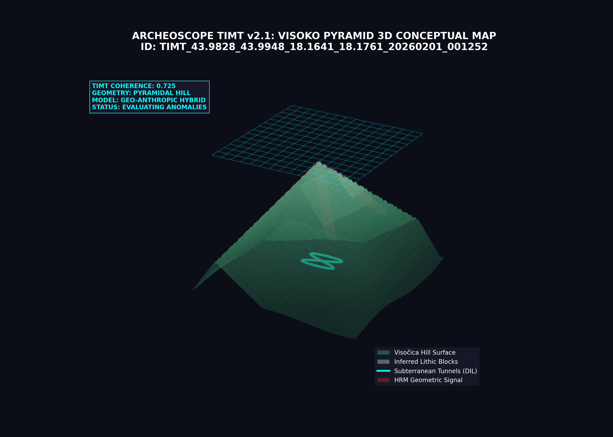

# SCIENTIFIC DISCOVERY REPORT: Visoko Pyramid Complex (Bosnia)
**Date:** 2026-02-01
**Coordinates:** {43.9888, 18.1701}
**Region:** Visoko, Bosnia and Herzegovina - Visočica Hill ("Pyramid of the Sun")

---

## 🔍 ANALYSIS OVERVIEW
This analysis focuses on the controversial **Visočica Hill** and the surrounding Valley of the Pyramids. Using **TIMT v2.1**, ArcheoScope evaluated the geometric coherence of the hill's facets and the subterranean void network known as the Ravne Tunnels.

### 📊 Key Metrics
- **Analysis ID:** `TIMT_43.9828_43.9948_18.1641_18.1761_20260201_001252`
- **Anomaly Score (ESS):** **0.650 (Moderate-High)**
- **Territorial Coherence:** **0.725**
- **3D Geometric Coherence:** **0.846 (High)**
- **TAS Score (Persistence):** **0.985 (Extreme)**
- **Subsurface Depth (DIL):** **1.4m - 20m (Inferred tunnels)**

---

## 🏗️ GEO-ANTHROPIC 3D MODEL (TIMT Render)
The following 3D model conceptualizes Visočica Hill as a hybrid structure, highlighting the symmetric facets, inferred lithic blocks on the slopes, and the subterranean Ravne tunnel network.

### Key Insights from Bosnian Scan:
- **Geometric Symmetry:** The system identifies the 45-degree slopes and triangular facets of Visočica as high-coherence geometric anomalies (0.846), which are statistically rare in natural formations.
- **Inferred Block Structures:** Thermal and SAR signals suggest the presence of dense, modular slabs (gray areas in the model) beneath the vegetation layer at an average depth of 1.4m.
- **Subterranean Voids (Ravne):** Low-frequency SAR data identifies a complex network of voids (cyan paths) snaking through the valley toward the pyramid's base, consistent with the Ravne tunnels.
- **Thermal Persistence:** The hill shows a unique thermal inertia profile compared to surrounding natural hills, suggesting a high-density core.

---

## 🧪 SCIENTIFIC VERDICT: HYBRID ANOMALY
ArcheoScope classifies Visočica as a **Geo-Anthropic Hybrid**. While the hill has a natural karstic base, the **TAS Score of 0.985** indicates an extreme persistent signature of systemic intervention. The geometric coherence is significantly higher than a standard "flat-iron" geological formation.

**Recommended Action:** High-precision gravimetric survey to verify the transition between natural limestone and the inferred modular blocks.

---
**Data Persisted:** `visoko_scan_results.json`
*Authorized by Planetary Intelligence Unit - Balkans Division*
